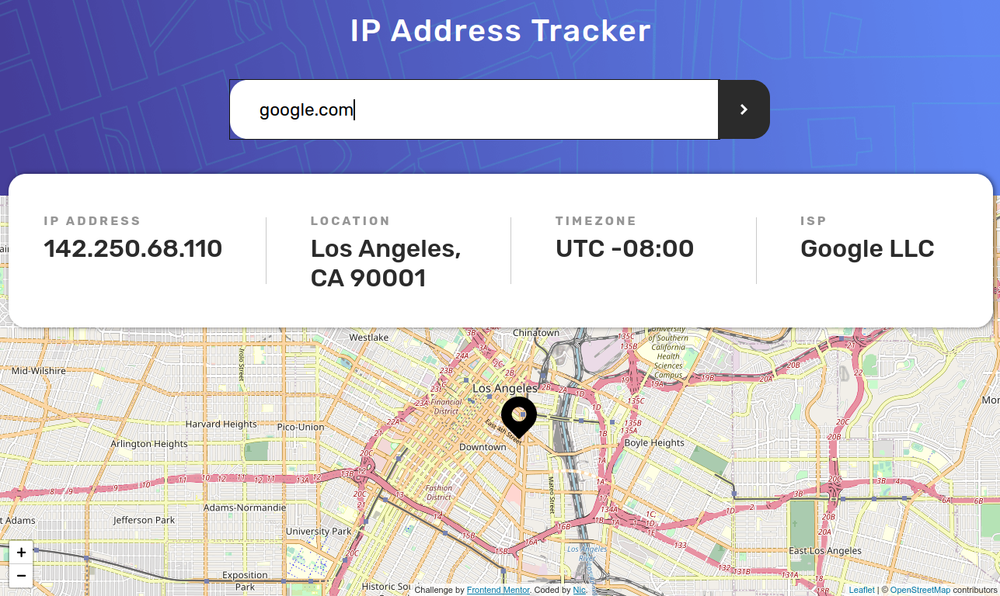

# IP Address Tracker
> [Frontend Mentor](https://www.frontendmentor.io/)'s IP Address Tracker

## Table of contents
* [General info](#general-info)
* [Screenshots](#screenshots)
* [Technologies](#technologies)
* [Setup](#setup)
* [Features](#features)
* [Status](#status)
* [Inspiration](#inspiration)
* [Contact](#contact)

## General info
I needed to practise using APIs so I found a Frontend Mentor project that required them. This one looked fun..

Having learnt Webpack I then tried it out on this project. As well as splitting up my JS files, having finally discovered why you would do such a thing.

## Screenshots

## Technologies
* HTML
* SCSS
* JavaScript: aync/await
* Webpack
* [IP Geolocation API](https://geo.ipify.org/) for IP address/domain data
* [LeafletJS](https://leafletjs.com/) for mapping the data
* [OpenStreetMap](https://www.openstreetmap.org/#map=5/54.910/-3.432) to show the map

## Setup
To view this project visit the [demo](https://ipaddresstracker-nm.netlify.app/) or download the files and open index.html

## Features
* On load picks up your IP address and shows the data and your location
* You can search for any IP address or domain

## Status
Project is: _finished_

## Inspiration
Design provided by [Frontend Mentor](https://www.frontendmentor.io/)

## Contact
Created by [nim42](https://www.twitter.com/nicm4242) - feel free to contact me!
